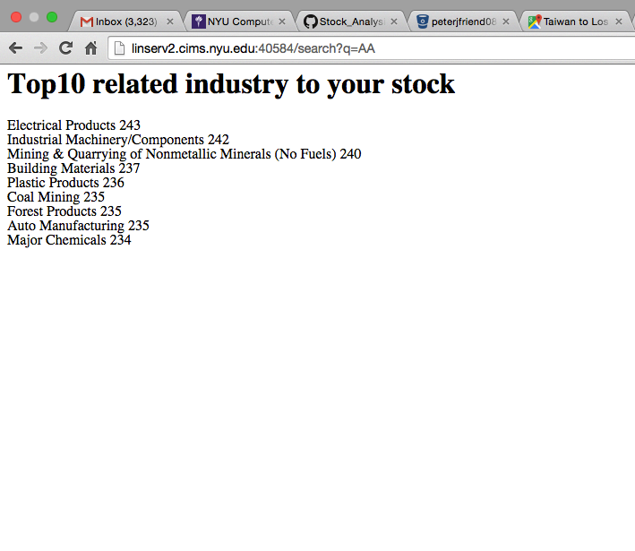

#Stock_Analysis_Engine
This is the directory for category correlation

#Working data source
[Google Drive](https://drive.google.com/open?id=0BzG5zLRRrgKwfkthYmJhdW94aUE1QVpDeTN4bnhsVDJuNmJSZ1d2aElaSExJaUVpWWs5ZDg&authuser=0)

#User Interface

#Usage:
>`cat ./constant/PriceDiff_360days.txt ./output/correlation_output_Step1_TAG.txt |python ./src/categoryCorrelation_step2_mapper.py |sort|python ./src/categoryCorrelation_step2_reducer.py > ./output/correlation_output_Final.txt`

Start HTTP interface
>`python start.py`

#Steps:
##Combine raw data
- Merge stock close price for the past 360 days
- Append market cap and industury category
- Output: ClosePrice_360days.txt

>`./bin/preprocess_merge.R`

##Compute MarketCap percentage in each specific industry
- First pass to calculate the total marketCap for each industry
- Second pass to get the precentage of that stock in that industry
- Third pass to append MarketCap percentage info accordingly
- Output: ClosePrice_360days_complete.txt

>`cat ClosePrice_360days.txt|python ./src/preprocess_marketCap.py>ClosePrice_360days_complete.txt`

##Checks have been done
- Checked the industry of "Wholesale Distributors", and the percentage is correct
- Checked the stock "ZBK". Its marketCap is n/a, so the percentage is 0

#Analytic Works:
##Step 1: Get the index-weighted price-differences for each of industry
- Data Source: ./constant/PriceDiff_360days.txt. Definition of PriceDiff: Price_Day1_Close - Price_Day2_Close
- Mapper output:

>`[IndustryA, Day1_PriceDiff1*weight_Company1], ..., [IndustryA, Day365_PriceDiff365*weight_Company1],
[IndustryA, Day1_PriceDiff1*weight_Company2], ..., [IndustryA, Day365_PriceDiff365*weight_Company2],
[IndustryB, Day1_PriceDiff1*weight_Company7], ..., [IndustryB, Day365_PriceDiff365*weight_Company7],
[IndustryB, Day1_PriceDiff1*weight_Company8], ..., [IndustryB, Day365_PriceDiff365*weight_Company8],`

- Hadoop will partition the Industry(key) and sort it to reducer. Will looks like:
- Reducer output: 

>`[IndustryA, (Day1_WeightedPriceDiff1, Day2_WeightedPriceDiff2, ..., Day365_WeightedPriceDiff365, )],
[IndustryB, (Day1_WeightedPriceDiff1, Day2_WeightedPriceDiff2, ..., Day365_WeightedPriceDiff365, )],
[IndustryZ, (Day1_WeightedPriceDiff1, Day2_WeightedPriceDiff2, ..., Day365_WeightedPriceDiff365, )],`

- Usage:

>`python ./src/relation_step1_mapper.py <./constant/PriceDiff_360days.txt|sort|python ./src/categoryCorrelation_step1_reducer.py > ./output/correlation_output_Step1.txt`

##Step 2: Batch MapReduce correlation-count for each stock to ALL industries
- Input: Two files, first is ./constant/correlation_output_Step1.txt; second is ./constant/PriceDiff_360days.txt
- Preprocess: add tag for correlation_output_Step1.txt
>` python src/preprocess_addTAG.py < output/correlation_output_Step1.txt > output/correlation_output_Step1_TAG.txt`

- Mapper output:
>[Stock1, [Prices]]  [Stock1 --> [#TAG_Industry1 --> [Industry1_Prices] ]],  
>[Stock1 --> [#TAG_#Industry2 --> [Industry2_Prices] ]],
>[Stock1 --> [#TAG_Industry3 --> [Industry3_Prices] ]],
>[Stock1 --> [#TAG_IndustryM --> [IndustryM_Prices] ]],
>
>[Stock2, [Prices]],
>[Stock2 --> [#TAG_Industry1 --> [Industry1_Prices] ]],
>[Stock2 --> [#TAG_Industry2 --> [Industry2_Prices] ]],
>[Stock2 --> [#TAG_Industry3 --> [Industry3_Prices] ]],
>[Stock2 --> [#TAG_IndustryM --> [IndustryM_Prices] ]],

Please see ./ouput/mapper_tmp_1000lines.txt to have idea about data structure.
So this way, although a bit expensive, we can garuntee each stock can compare to ALL category

- Reducer output:

>>A	{'Miscellaneous': 195, 'Computer Manufacturing': 227,..., 'Textiles': 221}
>>
>>AAOI	{'Miscellaneous': 179, 'Computer Manufacturing': 198,..., 'Textiles': 203}

Please see ./ouput/reducer_tmp_1000lines.txt to have idea about data structure.

##ToDos
- Double check readme
- Double check source code
- Double check correctness of processed data
- Start coding!